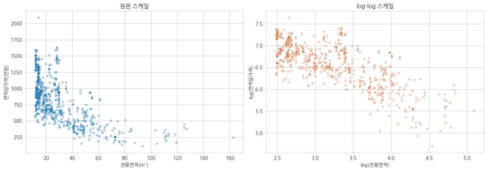
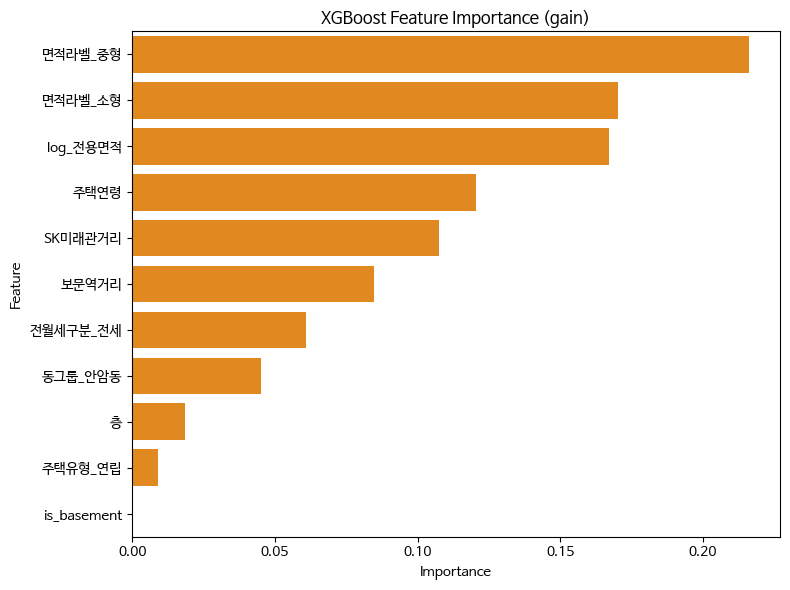
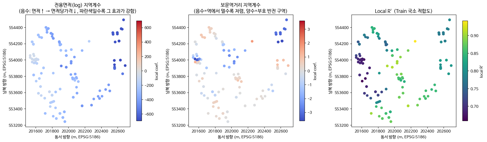
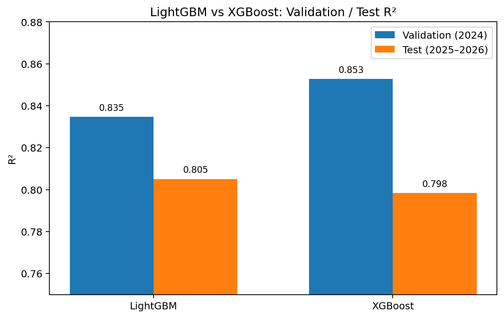

# 🏠 안암·보문 전월세 시세 스크리닝 모델

### 청년 임차인의 정보비대칭 완화를 위한 실거래 기반 접근

**KU해줘, 집값** · 24기 김유진 · 김하진 · 서지우 · 윤서영

------------------------------------------------------------------------

## 📌 프로젝트 소개

청년 임차인이 전월세 계약 시 겪는 **시세 정보비대칭** 문제에서 출발하였다.

### 목표

1.  안암·보문 지역 전월세 **시세예측 모델 구축**
2.  선형·비선형·공간모형 비교
3.  **호가와 예측 시세의 괴리율**을 활용한 계약 전 가격 점검 서비스로 확장

> 예측값은 과거 실거래와 매물 특성을 기반으로 추정한 **시장 가격수준**이다.

------------------------------------------------------------------------

## 🗂️ 데이터

| 구분        | 내용               |
|-------------|--------------------|
| 지역        | 서울 안암동·보문동 |
| 기간        | 2023.01 \~ 2026.07 |
| 주택유형    | 연립·다세대        |
| 단위        | 개별 임대차 계약   |
| Task        | Regression         |
| Target      | `면적당가격_만원`  |
| 최종 데이터 | 1,286건            |

### 출처

- **국토교통부 실거래가 API**: 연립·다세대 전월세 거래
- **한국부동산원**: 전월세전환율
- **Kakao Local API**: 주소 → 위·경도 변환

------------------------------------------------------------------------

## 🔄 Target

전세와 월세를 동일 기준에서 비교하기 위해 **환산보증금**을 사용하였다.

``` text
환산보증금 = 보증금 + (월세 × 12) / r
r = 전월세전환율(소수)
```

``` text
면적당가격(만원/㎡) = 환산보증금 / 전용면적
```

> 면적당가격은 전용면적을 분모로 사용하므로, 면적 관련 결과는 인과효과가 아닌 **예측 관계 중심으로 해석**하였다.

------------------------------------------------------------------------

## 🧹 전처리 및 Feature Engineering

### 주요 전처리

- 중복·결측·이상값 점검
- 안암동·보문동 필터링
- 전세/월세 구분
- 계약일자·주택연령 생성
- 로그 Z-score 기반 이상치 처리
- 범주형 변수 One-Hot Encoding

### 주요 파생변수

- `log_전용면적`
- `주택연령`
- `is_basement`
- `면적라벨`
- `동그룹`
- `전월세구분`
- `SK미래관거리`
- `보문역거리`

------------------------------------------------------------------------

## 🔎 EDA

### 주요 확인 내용

- 전용면적과 면적당가격의 비선형 관계
- 주택연령·층수와 가격의 관계
- 학교·지하철 거리와 가격의 관계
- 신규 / 합의갱신 / 갱신요구권사용 계약 비교
- 반지하 여부에 따른 가격 차이
- 상관관계 및 VIF 점검



*Figure 1. 전용면적과 면적당가격의 관계*

### 계약구분

- 신규 / 합의갱신 / 갱신요구권사용 거래 특성 비교
- EDA에서만 활용
- 최종 Tree Model 피처에는 미포함

### 반지하 변수

- 2023\~2024 분석 구간 반지하 표본: **14건**
- Cohen's d: **약 1.2**
- LightGBM(split) importance: **0**
- XGBoost(gain) importance: **0**
- 표본 수가 적어 Tree Model에서 분기 기준으로 활용되지 않은 것으로 판단

------------------------------------------------------------------------

## ⚙️ 모델링

MLR을 기준모형으로 두고 비선형·공간 방향으로 확장하였다.

``` text
                     ┌─ Global Nonlinear
                     │  LightGBM / XGBoost
Global Linear ───────┤
     MLR             │
                     └─ Local Spatial
                        GWR
```

### 1. MLR — Global Linear

- OLS 기반 다중선형회귀
- p-value·VIF 기반 변수 정리
- 회귀계수 해석

**Test R² = 0.6492**

### 2. LightGBM — Global Nonlinear

- 비선형 관계 및 변수 간 상호작용 반영
- 2023 Train / 2024 Validation / 2025\~2026 Test
- Validation 기반 Early Stopping
- Feature Importance: **split 기준**

### 3. XGBoost — Global Nonlinear

- LightGBM과 동일 피처 사용
- Validation 성능 기준 비교
- Feature Importance: **gain 기준**
- **Validation 기준 최종 선정 모델**



*Figure 2. XGBoost Feature Importance (gain)*

> 면적 관련 변수군의 예측 기여도가 높게 나타났으며, Feature Importance는 변수의 인과적 영향력을 의미하지 않는다.

### 4. GWR — Local Spatial

- 위치별 Local coefficient 추정
- Adaptive bisquare kernel
- AICc 기반 bandwidth 선택
- Bandwidth: **58개 최근접 이웃**
- 최근접 이웃거리 중앙값: **약 279m**

**Test R² = 0.6817**



*Figure 3. GWR Local coefficient 및 Local R²*

- 위치별 Local coefficient 차이 탐색
- 공간적 가격구조를 살펴보기 위한 보조모형으로 활용

> Local R²는 Train 데이터의 국소 적합도를 나타내는 진단 지표이다.

------------------------------------------------------------------------

## 🧪 데이터 분할

부동산 가격의 시간적 변화를 고려해 **랜덤 분할 대신 연도 기준 Temporal Holdout**을 사용하였다.

``` text
2023~2024     → Model Development
2025~2026     → Test
```

| Model    | Train      | Validation | Test       | Validation 역할            |
|----------|------------|------------|------------|----------------------------|
| MLR      | 2023\~2024 | \-         | 2025\~2026 | \-                         |
| LightGBM | 2023       | 2024       | 2025\~2026 | Early Stopping             |
| XGBoost  | 2023       | 2024       | 2025\~2026 | Early Stopping / 모델 선정 |
| GWR      | 2023       | 2024       | 2025\~2026 | 진단용                     |

- LightGBM·XGBoost는 2024 Validation을 Early Stopping 및 모델 비교에 활용
- GWR의 bandwidth는 Train에서만 선택하고 2024 Validation은 진단용으로 활용
- MLR은 별도 튜닝 과정이 없어 2023\~2024를 통합 학습

> 모델별 목적과 학습 방식에 따라 Train·Validation 활용 구조가 일부 다르므로, 전체 Test 성능은 동일 조건의 절대적인 모델 순위라기보다 각 모델의 시점 외 예측성능을 비교하는 참고 지표로 해석하였다.

------------------------------------------------------------------------

## 📊 최종 모델 선정

### Validation (2024)

| Model       |         R² |       RMSE |       MAE |
|-------------|-----------:|-----------:|----------:|
| LightGBM    |     0.8347 |     141.06 |     98.10 |
| **XGBoost** | **0.8528** | **133.11** | **97.16** |

### Final Model

**XGBoost**



*Figure 4. LightGBM·XGBoost Validation/Test R² 비교*

최종 모델은 Test 결과를 기준으로 재선정하지 않고, **사전에 설정한 2024 Validation 성능을 기준으로 XGBoost를 선정**하였다.

> Test에서는 LightGBM이 소폭 우세했으나, 두 Tree Ensemble의 성능 차이는 크지 않았다.

------------------------------------------------------------------------

## 📈 Test 결과

| Model        |         R² |       RMSE |        MAE |
|--------------|-----------:|-----------:|-----------:|
| MLR          |     0.6492 |     204.25 |     159.29 |
| **LightGBM** | **0.8051** | **152.25** | **110.22** |
| XGBoost      |     0.7984 |     154.85 |     117.65 |
| GWR          |     0.6817 |     194.57 |     141.40 |

- Validation 우위: **XGBoost**
- Test 우위: **LightGBM**
- 최종 선정 모델: **XGBoost**
- 두 Tree Ensemble의 Test R²는 약 **0.80**으로 유사한 수준

------------------------------------------------------------------------

## 💡 주요 결과

- LightGBM / XGBoost가 MLR 대비 높은 미래 시점 예측성능을 보임
- XGBoost에서는 면적 관련 변수군의 예측 기여도가 높게 나타남
- GWR을 통해 위치별 회귀계수 차이를 탐색
- 반지하 변수는 EDA에서 차이가 확인되었으나 소표본으로 인해 Tree Model에서는 활용되지 않음

------------------------------------------------------------------------

## 🏠 활용 방향

### 호가 적정성 진단 서비스

``` text
매물 정보 + 호가 입력
        ↓
모델 기반 시세 예측
        ↓
호가와 예측 시세 비교
        ↓
괴리율 계산
        ↓
계약 전 가격 수준 점검
```

### 기대 활용

- 청년 임차인의 **계약 전 가격 수준 점검**
- 주변 실거래 정보가 부족한 상황에서 **의사결정 보조**

> 본 모델은 가격 수준을 예측하는 모델이며, 계약 안전성이나 전세사기 여부를 판단하지 않는다.

### 확장성

- 동일한 분석 프레임워크를 활용해 **타 대학가·지역으로 확장 가능**
- 지역별 교통·학교·생활 인프라 변수를 재구성하여 재학습

------------------------------------------------------------------------

## ⚠️ 한계

- 안암·보문 지역에 한정된 표본
- 반지하 등 일부 변수의 적은 관측치
- 모델별 학습·검증 구조 차이
- 이상치 처리 기준 산출에 전체 기간(Train·Test 포함)의 Target 분포를 활용하여 **Temporal Holdout 원칙상 일부 정보 누출 가능성이 있음**
- 금리·시장추세 등 시간효과 미반영
- 계약 안전성·전세사기 여부는 예측 대상이 아님
- 괴리율 임계값 미검증

------------------------------------------------------------------------

## 🚀 추후 과제

- 호가 입력 → 괴리율 자동 계산 서비스 구현
- 신규 매물 입력값 → Feature 자동 변환
- 괴리율 경고 기준 검증
- Prediction Interval / Conformal Prediction 적용
- 금리·시점 변수 추가
- 타 대학가·지역으로 확대
- 모델 간 학습·검증 조건 통일
- Train 데이터만을 기준으로 전처리 기준 산출

------------------------------------------------------------------------

## 🔎 Project Significance

본 프로젝트는 안암·보문 지역의 실거래 데이터를 기반으로 개별 매물의 **시장 가격수준을 예측**하고, 실제 호가와의 차이를 점검할 수 있는 시세 스크리닝 구조로 확장하였다.

**청년 임차인의 계약 전 가격 정보비대칭 완화를 위한 실거래 기반 시세 스크리닝 모델**
