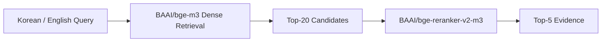
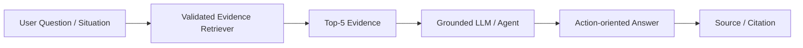

# 국내 체류 외국인을 위한 다국어 금융 상황 이해 챗봇

## 1. 프로젝트 배경

한국에서 생활하는 외국인은 계좌 개설, 카드 사용, 해외송금, 환전, 금융사기 대응처럼 일상에 필요한 금융정보를 여러 기관에서 찾아야 합니다. 관련 정보는 정부·은행·금융감독기관·공공기관의 PDF와 웹페이지에 분산되어 있고, 안내문에는 금융용어와 함께 조건, 예외, 필요서류, 금액과 기한이 복합적으로 제시됩니다.

한국어에 익숙하지 않은 사용자는 공식자료를 찾은 뒤에도 자신의 상황에 적용되는 내용을 판단하기 어렵습니다. 번역은 문장의 언어를 바꾸는 데 도움을 주지만, 여러 자료에서 필요한 근거를 찾아 “무엇을 확인하고 지금 무엇을 해야 하는가”로 연결하는 것까지 보장하지 않습니다.

## 2. Target User와 문제 정의

### Target User

- 한국에서 처음 금융서비스를 이용하는 외국인
- 계좌·카드·송금·환전의 조건과 필요서류를 확인하려는 사용자
- 금융기관 안내문이나 금융사기 의심 상황을 이해해야 하는 사용자
- 한국어 또는 영어로 공식 금융정보를 찾고 싶은 사용자

### Problems

- **분산된 정보:** 필요한 금융정보가 여러 기관의 PDF와 웹페이지에 나뉘어 있습니다.
- **언어 장벽:** 한국어 금융용어와 기관별 표현이 공식 근거 탐색을 어렵게 만듭니다.
- **복잡한 조건:** 체류 상태, 거래 목적, 필요서류, 금액, 기한과 예외를 함께 확인해야 합니다.
- **안전 문제:** 기관 사칭, 링크 클릭, 송금 및 개인정보 요구와 같은 위험 신호와 공식 대응 절차를 빠르게 파악해야 합니다.
- **번역 이후의 판단:** 번역된 문장을 이해하는 것만으로는 사용자가 취해야 할 다음 행동이 명확하지 않을 수 있습니다.

이 서비스는 금융상품 추천, 가입 가능 여부의 확정 판정, 실거래 수행 또는 사기 여부의 법적 확정을 목표로 하지 않습니다. 공식자료에 근거해 사용자가 정보를 이해하고 안전한 다음 행동을 판단하도록 돕는 정보 서비스입니다.

## 3. 제안 서비스

사용자가 한국어 또는 영어로 금융 질문이나 상황을 입력하면, 관련 공식자료를 검색하고 그 근거를 바탕으로 이해하기 쉬운 행동 중심 답변과 출처를 제공하는 챗봇을 제안합니다.

```text
사용자 질문 또는 금융 상황
→ 공식 금융자료에서 관련 evidence 검색
→ 핵심 조건·서류·금액·기한·위험 신호 확인
→ 지금 할 일 / 하지 말아야 할 일 안내
→ 근거와 출처 제시
```

예를 들어 사용자가 “한국에서 계좌를 만들 때 어떤 서류가 필요한가요?”라고 묻거나 “보이스피싱 전화를 믿고 송금했다면 무엇을 해야 하나요?”라고 상황을 설명하면, 챗봇은 먼저 검증된 corpus에서 관련 evidence를 찾습니다. 이후 답변 생성 단계는 검색된 근거 안에서 필요한 정보와 공식 확인 경로를 설명하는 방향으로 설계합니다.

## 4. 왜 Evidence Retrieval이 필요한가

금융 안내에서는 자연스러운 문장 생성보다 올바른 근거를 먼저 찾는 일이 중요합니다.

- 필요서류, 금액, 기한과 예외 조건은 원문과 정확히 일치해야 합니다.
- 금융사기 대응은 일반적인 조언보다 공식 기관이 안내한 행동과 확인 채널을 우선해야 합니다.
- 근거가 부족한 상황에서는 확정적인 답변 대신 확인이 필요하다는 사실을 알려야 합니다.
- 답변에 출처를 연결하려면 어떤 document와 chunk를 사용했는지 추적할 수 있어야 합니다.

따라서 프로젝트는 먼저 Korean/English 질문을 검증된 Top-5 evidence와 연결하는 Retriever를 구축하고 평가했습니다. Retriever는 향후 챗봇이 근거 기반 답변을 만들기 위한 기반 계층입니다.

## 5. 공식 금융자료와 평가 기반

정부·금융기관·공공기관의 계좌, 카드, 송금, 환전, 안내문 이해와 금융사기 예방 자료를 공통 schema로 정리했습니다.

- 공식자료 21개: PDF 8개, Web 13개
- Final corpus: BGE-M3 tokenizer 기준 400 tokens, overlap 60, 총 563 chunks
- Evaluation questions: 120개
- Validation 80 / Test 40, split overlap 0
- 한국어와 영어 질문이 같은 evidence와 gold mapping을 공유
- 네 영역 각 30문항: 계좌·카드, 해외송금·환전, 안내문 이해, 금융사기·안전

Corpus와 evaluation dataset은 retrieval 실험 전에 extraction 범위, chunk coverage와 gold mapping을 검증했습니다. 이 과정은 데이터 오류 자체를 프로젝트 성과로 내세우기 위한 것이 아니라, 서로 다른 retrieval 구조를 신뢰할 수 있는 기준에서 비교하기 위한 준비입니다.

### 5.1 Chunking 균형점 선택

금융 문서의 조건, 예외, 금액, 기한은 서로 연결되어 있습니다. Chunk가 너무 작으면 필요한 문맥이 나뉘고, 너무 크면 여러 주제가 섞여 검색과 ranking의 변별력이 낮아질 수 있습니다.

이를 확인하기 위해 300/50, 400/60, 500/80을 동일 Final corpus, gold, Korean Test40, Dense model과 reranker 조건에서 비교했습니다. 300/50과 400/60의 전반적인 성능은 유사했고 300/50이 일부 Top-5 지표에서 소폭 앞섰습니다. 반면 400/60은 Recall@20 공동 최고, candidate MRR 최고를 기록하면서 300/50보다 약 21% 적은 chunk를 사용했습니다. 500/80은 candidate coverage와 final ranking이 상대적으로 낮았습니다.

결과적으로 400/60을 단일 metric의 최적값이 아니라, 검색 성능·문맥 보존·corpus 규모 사이의 균형점으로 선택했습니다.

## 6. Retrieval Experiment Journey

### 6.1 Korean Retrieval

첫 번째 질문은 “정확한 어휘를 찾는 BM25와 의미 검색을 수행하는 Dense를 결합하면 더 안정적인가?”였습니다. BM25, BGE-M3 Dense, BM25+Dense Hybrid(RRF), reranker를 비교하고, 마지막에는 Dense 후보와 Hybrid 후보를 동일한 reranker에 연결해 직접 평가했습니다.

Hybrid는 일부 evidence coverage에서 이점이 있었지만 question-level Hit은 Dense와 같았고, Dense는 candidate 지표와 최종 ranking quality에서 전반적으로 더 안정적이었습니다. BM25가 Dense miss를 보완한 사례도 있었지만 Hybrid 결합으로 Dense의 gold 후보가 사라진 사례가 더 많았습니다.

이에 따라 작은 지표 차이를 과장하지 않으면서 후보 안정성, ranking quality와 시스템 단순성을 함께 고려해 Korean Dense→Reranker를 선택했습니다.

### 6.2 English Retrieval

영어 질문으로 현재 금융 corpus를 검색하기 위해 다음 질문을 순서대로 검증했습니다.

1. **Multilingual Dense가 번역 없이 영어 질문을 직접 처리할 수 있는가?**
   BGE-M3 Dense는 English Test40에서 Hit@20 0.9500을 기록해 강한 direct cross-lingual baseline이 되었습니다.

2. **Sparse signal이 Dense의 miss를 보완할 수 있는가?**
   BGE-M3 Sparse는 일부 다른 후보를 찾았지만 평균 성능이 낮았습니다. Dense+Sparse fusion에서도 추가 signal과 Dense 성능을 동시에 안정적으로 보존하지 못했습니다.

3. **한국어 lexical signal은 보완 가능성이 있는가?**
   Paired Korean question을 사용한 diagnostic에서 가능성을 확인한 뒤, 실제 NLLB English→Korean translation과 Elasticsearch Nori BM25를 Validation80에서 평가했습니다. Validation에서는 Nori가 일부 Dense miss를 보완했습니다.

4. **Validation의 fusion 이점이 held-out Test에서도 유지되는가?**
   Validation에서 선택한 Dense15+Nori5 구조를 고정해 Test40에서 평가했습니다. Fusion은 Dense hit을 잃지 않고 evidence Recall과 일부 ranking metric을 소폭 높였지만, 새롭게 맞힌 question-level final hit은 0건이었습니다.

Translation과 lexical retrieval의 complementary signal 자체를 부정하는 결과는 아닙니다. 다만 Test에서 추가 question coverage가 재현되지 않았고, 번역 오류 가능성, NLLB 추론과 Elasticsearch/Nori 운영 복잡도를 함께 고려하면 main path로 채택할 근거가 충분하지 않았습니다. 따라서 English도 번역 없는 Dense→Reranker를 선택했으며 Test 결과를 이용한 추가 tuning은 수행하지 않았습니다.

## 7. 최종 Retriever

한국어와 영어에 동일한 구조를 사용합니다.



이 구조는 번역이나 별도 언어 routing 없이 두 언어의 질문을 처리합니다. English Test40과 Korean Test40 모두 Dense candidate Hit@20 0.9500을 기록했으며, 최종 선택은 단일 지표가 아니라 Recall, Hit, ranking quality, question-level complementarity와 운영 복잡도를 함께 고려한 결과입니다.

## 8. Chatbot / Agent Integration

현재 검증된 Retriever는 챗봇에 출처를 추적할 수 있는 evidence를 공급하는 기반 계층입니다.



향후 downstream Agent는 다음 원칙에 따라 Top-5 evidence를 사용할 수 있습니다.

- 질문과 같은 언어로 핵심 금융정보 설명
- 필요서류, 금액, 기한, 조건과 예외 정리
- 금융사기 상황의 위험 신호와 공식 대응 행동 제시
- evidence로 확정할 수 없는 내용은 공식 기관 확인 안내
- 사용한 source와 답변 citation 연결

이 Top-5 evidence는 향후 Agent orchestration, grounded LLM generation, citation 검증, UI와 deployment로 연결할 수 있습니다.

## 9. Expected User Experience

사용자는 여러 기관의 긴 PDF와 웹페이지를 직접 탐색하는 대신 자신의 상황을 자연어로 질문합니다. 서비스는 질문 언어에 맞춰 관련 공식 근거를 찾고, downstream 단계에서 다음과 같은 형태의 답변을 제공하는 것을 목표로 합니다.

1. 질문 또는 상황의 핵심 요약
2. 공식자료에서 확인된 조건과 정보
3. 지금 확인하거나 수행할 행동
4. 피해야 할 행동과 위험 신호
5. 불확실하거나 기관 확인이 필요한 내용
6. 사용한 근거와 출처

## 10. 기대 효과

- 외국인이 공식 금융정보를 찾는 시간과 탐색 부담 감소
- 한국어와 영어 질문에서 동일한 evidence retrieval 경험 제공
- 계좌·카드·송금·환전 조건과 필요서류에 대한 접근성 향상
- 금융사기 상황에서 공식 위험 신호와 대응자료에 더 빠르게 접근
- 답변 생성 이전에 출처가 추적 가능한 evidence를 확보해 신뢰성 기반 마련

## 11. 현재 범위와 Next Step

### 현재 완료·검증 범위

```text
공식 금융자료 수집·정규화
→ Chunk corpus와 evaluation dataset
→ Korean/English retrieval 실험
→ BGE-M3 Dense Top-20
→ bge-reranker-v2-m3
→ Top-5 Evidence
```

### 다음 단계

- Top-5 evidence 기반 grounded answer generation
- 숫자·조건·서류·기관명 및 citation 일치 검증
- 상황별 행동 안내를 위한 Agent orchestration
- 사용자 UI와 배포
- 실제 외국인 사용자를 대상으로 한 이해도와 유용성 평가

## 12. 협업 및 기여

본 프로젝트는 KUBIG 팀의 금융자료 수집, RAG/서비스 설계, evaluation dataset 구축과 retrieval 검증 작업을 기반으로 수행되었습니다. 현재 repository는 이 협업 결과 중 data, Korean/English retrieval evaluation과 최종 Evidence Retriever architecture를 보존합니다. Agent, LLM generation, UI와 deployment는 별도 downstream 작업으로 이어집니다.
