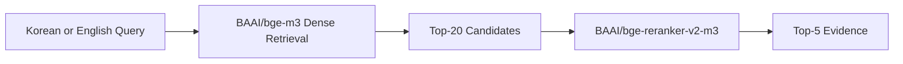

# 국내 체류 외국인을 위한 다국어 금융 상황 이해 챗봇

> Evidence Retriever Repository

## Project at a Glance

이 프로젝트는 한국에서 금융서비스를 이용하는 외국인의 한국어·영어 질문을 공식 금융자료의 근거와 연결하는 챗봇을 지향합니다. 현재 이 repository에서 구현하고 평가한 범위는 **Evidence Retriever**입니다. 정부·금융기관·공공기관의 PDF와 웹페이지를 검색해 질문과 관련된 Top-5 evidence를 반환합니다.

서비스 배경과 전체 사용자 경험은 [`PROJECT_OVERVIEW.md`](PROJECT_OVERVIEW.md)에서 확인할 수 있습니다.

## Repository Scope

검증 완료 범위:

```text
Data → Chunking → Gold Validation
→ Korean/English Retrieval Evaluation
→ Dense Top-20 → Reranker → Top-5 Evidence
```

전체 서비스에서는 이 evidence를 다음 downstream 단계로 연결할 수 있습니다.

```text
Top-5 Evidence → Grounded LLM Generation
→ Agent Orchestration → Citation/UI → Deployment
```

## Final Retriever Architecture



- 한국어와 영어 질문에 동일한 Retriever를 사용합니다.
- 영어 질문도 번역하지 않고 multilingual BGE-M3에 직접 입력합니다.
- Dense similarity로 Top-20 후보를 생성한 뒤 multilingual cross-encoder reranker로 Top-5를 정렬합니다.
- Translation, Nori, Sparse 및 fusion은 비교 실험 artifact로 보존하지만 final main path에는 포함하지 않습니다.

## Key Results

Final 400/60 corpus의 Test40 결과입니다.

| Query | Pipeline | Recall@20 | Hit@20 | Recall@5 | Hit@5 | MRR@5 | nDCG@5 |
|---|---|---:|---:|---:|---:|---:|---:|
| Korean | Dense→Reranker | 0.9333 | 0.9500 | 0.7792 | 0.8250 | 0.6446 | 0.6376 |
| English | Dense→Reranker | 0.8958 | 0.9500 | 0.8000 | 0.8750 | 0.6863 | 0.6543 |

Recall은 question별 gold evidence-group coverage, Hit은 하나 이상의 gold evidence group을 찾은 question 비율입니다. MRR은 첫 gold의 reciprocal rank, nDCG는 evidence-group-aware ranking quality를 나타냅니다. 두 언어의 수치 차이를 영어가 한국어보다 일반적으로 우수하다는 의미로 해석하지 않습니다.

## Data and Evaluation Snapshot

| Item | Value |
|---|---:|
| Documents | 21 |
| PDF / Web | 8 / 13 |
| Document language | Korean 15 / English 6 |
| Final chunks | 563 |
| Chunk size / overlap | 400 / 60 tokens |
| Tokenizer | `BAAI/bge-m3` |
| Evaluation questions | 120 |
| Validation / Test | 80 / 40 |
| Korean / English questions | 120 / 120 |
| Evidence items | 167 |

Evaluation dataset은 `account_card`, `remittance_exchange`, `notice_understanding`, `fraud_safety` 네 카테고리로 구성되며 각각 30문항입니다. 같은 question ID의 한국어·영어 질문은 동일한 split, evidence와 gold mapping을 공유합니다.

최종 400/60 corpus에서는 167개 evidence가 모두 gold chunk에 연결되며, boundary-aware validation 결과 PARTIAL, INVALID, CORPUS_ERROR, UNMATCHED는 모두 0건입니다. 이 검증을 바탕으로 서로 다른 retrieval 구조를 동일하고 재현 가능한 기준에서 비교했습니다.

### Chunk-size Selection

300/50, 400/60, 500/80을 동일 Final 21 documents, 167 evidence gold, Korean Test40, BGE-M3 Dense와 동일 reranker 조건에서 재생성·재평가했습니다. 세 설정 모두 gold coverage 100%를 확보했으며, 재생성한 400/60 chunk와 gold는 canonical Final artifact와 일치했습니다.

- 300/50과 400/60은 Recall@20 0.9333으로 같았고, 300/50이 일부 Top-5 지표에서 소폭 앞섰습니다.
- 400/60은 candidate MRR@20이 0.6244로 가장 높았고 300/50보다 152개, 약 21% 적은 chunk로 corpus를 구성했습니다.
- 500/80은 candidate coverage와 final ranking이 둘 다 상대적으로 낮았습니다.

따라서 400/60을 모든 metric의 유일한 최적값이 아니라 **retrieval performance, candidate ranking, context granularity와 corpus 규모의 균형점**으로 유지했습니다. 세부 비교는 [`retrieval_eval/reports/chunk_size_final_comparison.md`](retrieval_eval/reports/chunk_size_final_comparison.md)에서 확인할 수 있습니다.

## Experiment Summary

### Korean Retrieval

BM25, BGE-M3 Dense, BM25+Dense RRF Hybrid와 reranker를 비교했습니다. 최종 Test40 직접 비교에서 Hybrid는 evidence Recall@5가 0.0167 높았지만 Hit@5는 동일했습니다. Dense는 candidate Recall/Hit/MRR과 final MRR/nDCG가 더 높았고, BM25가 보완한 candidate question 1개보다 Hybrid에서 잃은 Dense hit이 2개였습니다. 후보 안정성, ranking quality와 단순성을 함께 고려해 Dense→Reranker를 선택했습니다.

### English Retrieval

Direct multilingual Dense, BGE-M3 Sparse, Dense+Sparse fusion, paired-Korean lexical diagnostic, 실제 NLLB translation→Nori BM25와 Dense+Nori fusion을 단계적으로 비교했습니다. Validation에서 Dense15+Nori5가 추가 coverage를 보였지만, 고정된 구조를 Test40에서 평가했을 때 new question-level candidate/final hit은 0건이었습니다. Fusion이 evidence Recall과 일부 ranking metric을 소폭 높였다는 사실은 유지하되, translation risk와 NLLB·Elasticsearch/Nori 운영 복잡도를 고려해 Dense-only candidate path를 선택했습니다.

## Repository Structure

```text
.
├── README.md
├── PROJECT_OVERVIEW.md
├── rag_evaluation_dataset.jsonl
├── retriever_dataset/
│   ├── documents/
│   ├── chunks/
│   └── metadata/
├── retrieval_eval/
│   ├── reports/
│   │   ├── chunk_size_final_comparison.md
│   │   ├── dense_vs_hybrid_reranker_test.md
│   │   ├── final_data_validation.md
│   │   ├── retrieval_validation_final.md
│   │   └── initial_method_chunk_comparison.md
│   ├── results/
│   │   └── ... Korean evaluation result/audit JSON
│   ├── gold/
│   │   └── ... gold label jsonl/csv
│   ├── chunk_size_final_artifacts/
│   ├── reference_baseline/
│   ├── eval_retrieval.py
│   ├── run_chunk_size_final_comparison.py
│   └── ... Korean evaluation code
└── retrieval_eval_en/
    ├── reports/
    │   └── ... English evaluation reports
    ├── results/
    │   └── ... English evaluation result JSON
    ├── data/
    │   └── ... Nori config, translation audit JSON
    └── ... English evaluation code
```

### Core Data

| Path | Role |
|---|---|
| `retriever_dataset/documents/` | 정규화된 21개 document corpus |
| `retriever_dataset/chunks/` | canonical Final 400/60 chunks와 과거 development variant; Final controlled 300/50·500/80은 `retrieval_eval/chunk_size_final_artifacts/`에 별도 보존 |
| `retriever_dataset/metadata/` | corpus 및 chunk 통계, duplicate report |
| `rag_evaluation_dataset.jsonl` | KO/EN 질문, structured answer, evidence와 gold chunk mapping을 포함한 120문항 evaluation dataset |

## Artifact Guide

### Korean Retrieval

| 확인하려는 내용 | Summary / Report | Raw or detailed artifact |
|---|---|---|
| Final chunk-size 선정 | [`retrieval_eval/reports/chunk_size_final_comparison.md`](retrieval_eval/reports/chunk_size_final_comparison.md) | `retrieval_eval/results/results_chunk_size_final_comparison.json`, `chunk_size_final_artifacts/` |
| Final corpus와 gold 검증 | [`retrieval_eval/reports/retrieval_validation_final.md`](retrieval_eval/reports/retrieval_validation_final.md) | `retrieval_eval/reports/final_data_validation.md`, `gold/gold_400_60_final.jsonl` |
| Final Korean architecture 결정 | [`retrieval_eval/reports/dense_vs_hybrid_reranker_test.md`](retrieval_eval/reports/dense_vs_hybrid_reranker_test.md) | `retrieval_eval/results/results_400_60_dense_vs_hybrid_reranker_test.json` |
| Final Validation/Test 결과 | `retrieval_eval/reports/retrieval_validation_final.md` | `results/results_400_60_ko_validation.json`, `results/results_400_60_ko_test.json` |
| 606-chunk baseline과 Final 비교 | `retrieval_eval/reports/retrieval_validation_final.md` | `results/results_400_60_2x2_matrix.json` |

### English Retrieval

| 확인하려는 내용 | Summary / Report | Raw or detailed artifact |
|---|---|---|
| English 최종 결정 | [`retrieval_eval_en/reports/english_retrieval_final_summary.md`](retrieval_eval_en/reports/english_retrieval_final_summary.md) | `results/results_400_60_en_dense_nori_final_test.json` |
| 전체 실험 의사결정 흐름 | [`retrieval_eval_en/reports/retrieval_en_progress.md`](retrieval_eval_en/reports/retrieval_en_progress.md) | `retrieval_eval_en/results/results_*.json` |
| Dense baseline | `retrieval_eval_en/reports/en_dense_reranker_test.md` | `results/results_400_60_en_dense_reranker_test.json` |
| Sparse와 Dense+Sparse | `retrieval_eval_en/reports/en_sparse_reranker_test.md`, `retrieval_eval_en/reports/en_dense_sparse_fusion_test.md` | 대응 `retrieval_eval_en/results/results_*.json` |
| Translation/Nori와 fusion | `retrieval_eval_en/reports/en_translated_nori_validation.md`, `retrieval_eval_en/reports/en_dense_nori_fusion_validation.md`, `retrieval_eval_en/reports/en_dense_nori_final_test.md` | 대응 Validation/Test JSON과 translation audit JSON |

### Historical / Development Notes

| Path | Role |
|---|---|
| `retrieval_eval/reference_baseline/606_chunk_baseline/` | Final 563-chunk corpus 이전 historical 606-chunk baseline의 재현·비교 snapshot |
| `retrieval_eval/reports/initial_method_chunk_comparison.md` | 300/50, 400/60, 500/80 초기 chunk-setting 비교를 보존한 historical development report (구 `test1.md`); 현재 final architecture의 source of truth는 아님 |

## Reproduction Resources

- `retrieval_eval/eval_retrieval.py`: BM25, Dense, Hybrid와 reranker 평가 및 evidence-group-aware metric 구현
- `retrieval_eval/prepare_retrieval_data.py`: document extraction, chunking과 gold mapping 관련 로직
- `retrieval_eval/run_chunk_size_final_comparison.py`: Final 300/50·400/60·500/80 chunk 재생성, gold remapping과 Dense→Reranker 비교
- `retrieval_eval/requirements.txt`: retrieval evaluation 환경 의존성
- `retrieval_eval/FinAgent_Retrieval_Eval_Colab.ipynb`: Colab 실행용 notebook
- `retrieval_eval/cache/`: Final corpus dense embedding cache

새 결과를 생성할 때는 기존 report 경로를 덮어쓰지 않도록 명시적인 output path를 사용해야 합니다. Canonical 결과를 확인하는 목적이라면 위 Artifact Guide의 tracked JSON과 Markdown을 우선 사용합니다.

## Downstream Integration

Retriever output인 Top-5 evidence는 이후 LLM/Agent가 grounded answer를 생성할 때 사용하는 입력입니다. Downstream layer는 실제 chunk text와 source metadata를 유지하고, 답변의 숫자·조건·서류·기관명 및 citation이 evidence와 일치하는지 별도로 검증해야 합니다.

전체 서비스의 문제 정의, 제안 사용자 경험과 향후 확장 구조는 [`PROJECT_OVERVIEW.md`](PROJECT_OVERVIEW.md)를 참고하세요.
