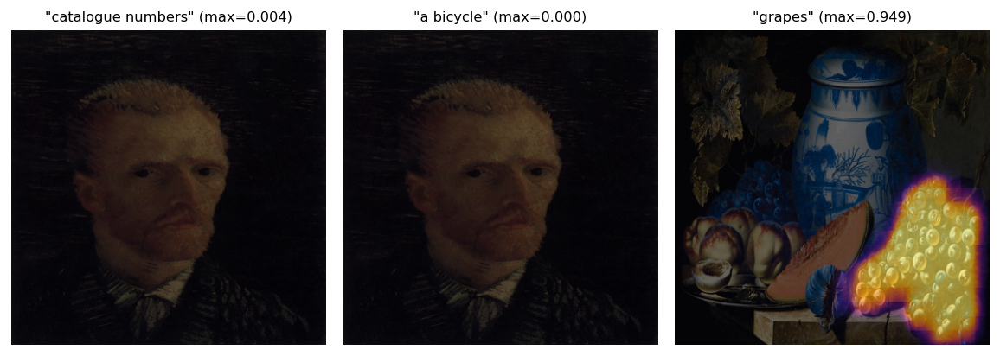
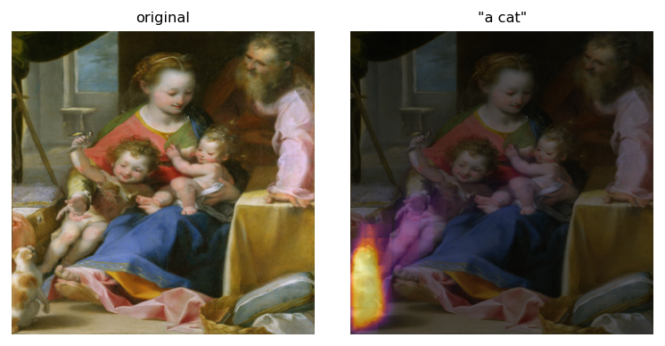
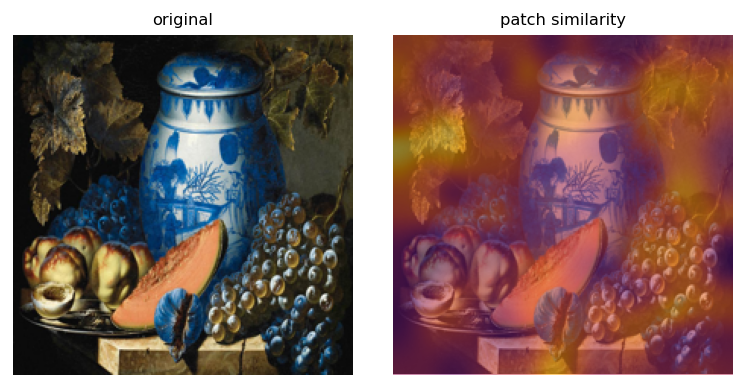
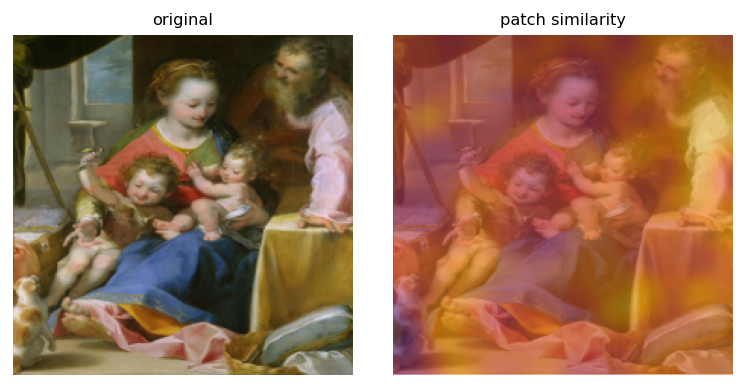

# CLIP Modality Gap — SemArt

CLIP의 modality gap(이미지 임베딩 무리와 텍스트 임베딩 무리가 공유 공간에서 분리되는 현상)을
미술 도메인(SemArt: 유럽 고전 회화 + 예술 해설)에서 탐구하는 사후 분석 프로젝트.
전부 frozen 모델에서 임베딩만 뽑아 분석하며, 별도 학습은 하지 않는다.

## 프로젝트 문서

| 문서 | 내용 |
|---|---|
| [PROJECT_v2.md](PROJECT_v2.md) | 초기 가설 — Schrodi et al.(ICLR 2025)의 정보 불균형 이론을 이미지·텍스트 2차원 격자로 확장. COCO/SemArt에서 이미지 열화(블러·다운샘플·crop·물체 마스킹) 스윕으로 U자 곡선을 찾음 |
| [PROJECT_v3.md](PROJECT_v3.md) | **현재 진행 방향** — Double-Ellipsoid(Levi & Gilboa, ICML 2025)의 conformity(전형성) 개념에 groundedness(접지성) 축을 추가해 2차원으로 분석. SemArt는 "독특하지만 이미지에 근거하지 않은" 텍스트가 많아, conformity만으로는 gap을 설명할 수 없다는 게 핵심 주장 |

각 문서 0장에 Claude Code가 지켜야 할 작업 원칙(Phase 순서, 임베딩 캐싱, 결과 예단 금지 등)이 정리되어 있다.

## 지금까지 나온 결과

전부 소규모 파일럿(수백 쌍 단위)이라 확정적 결론은 아니다. 원본 수치는 각 항목에 링크된
`results/*.json`, 인터랙티브 차트는 Claude 아티팩트 링크 참고(비공개 링크 — 공유 전까지는
작성자만 열람 가능).

### v2 트랙 — 정보 불균형 / U자 곡선

Schrodi의 이론대로면 이미지를 점점 열화시킬 때 gap이 줄었다 늘어나는 U자 곡선이 나와야 한다.

| 실험 | 결과 | 데이터 |
|---|---|---|
| Phase 0: COCO L2M 재현 | Liang 기준값 0.82에 대해 0.8232 재현 (오차 0.0032) | [`phase0_coco_reproduce.json`](results/phase0_coco_reproduce.json) |
| Phase 1: COCO 블러 스윕 | U자 아님, σ=0→32까지 단조 증가만 관찰 | [`phase1_coco_ucurve.json`](results/phase1_coco_ucurve.json) · [차트](https://claude.ai/code/artifact/9da90063-6bba-4654-9c51-ac551ccec03d) |
| SemArt 블러/다운샘플/crop 3종 비교 | 세 방식 모두 동일하게 단조 증가 — 특정 열화 방식의 아티팩트가 아님 | [`pilot_semart_blur.json`](results/pilot_semart_blur.json) · [`pilot_semart_degradations.json`](results/pilot_semart_degradations.json) · [차트](https://claude.ai/code/artifact/335e7aef-08da-4c41-8e1e-fee4cc046799) |
| SemArt, Long-CLIP 전체 텍스트(자르지 않음) | 여전히 단조 증가 — 77토큰 절단 문제가 원인이 아니었음을 확인 | [`pilot_semart_longclip_blur.json`](results/pilot_semart_longclip_blur.json) |
| **물체 마스킹 vs 배경 마스킹 (COCO, 이진)** | **같은 면적을 가려도 캡션이 설명하는 물체를 가리면 gap이 3.5배 더 크게 증가** (ΔL2M +0.061 vs +0.018) | [`phase1b_coco_object_mask.json`](results/phase1b_coco_object_mask.json) · [차트](https://claude.ai/code/artifact/6afff554-6aa0-4df6-823a-fcbc2d1480d3) |
| 물체 마스킹 강도 스윕 (0→100%) | 물체 곡선은 갈수록 가속(볼록), 배경 곡선은 면적에 선형 비례 — 그래도 U자는 아님 | [`phase1c_coco_object_mask_sweep.json`](results/phase1c_coco_object_mask_sweep.json) · [차트](https://claude.ai/code/artifact/9e74f161-9f0c-4e98-af5e-1b5102ed1ac9) |
| 아이디어 A: 텍스트 풀링 아티팩트 검증 | 문서 전체를 한 벡터로 뭉개는 게 gap을 일부(~5%) 부풀리지만, 대부분은 SemArt 문장 자체가 실제로 덜 접지되어 있기 때문 | [`idea_a_multivector_gap.json`](results/idea_a_multivector_gap.json) |

**결론**: U자 곡선은 어떤 방식으로도(3종의 이미지 열화, 텍스트 길이 제거, COCO/SemArt 양쪽) 재현되지 않았다.
대신 **"정보가 얼마나 없어졌는가"보다 "캡션과 관련된 정보가 없어졌는가"가 gap을 훨씬 크게, 가속적으로 좌우한다**는
일관된 패턴을 확인 — Schrodi의 object bias 메커니즘을 더 직접적으로 뒷받침하는 결과.

### v3 트랙 — Conformity × Groundedness (현재 진행 방향)

| 실험 | 결과 | 데이터 |
|---|---|---|
| Phase 1: thin shell / conformity 근사식 검증 (SemArt, Long-CLIP) | Pearson 0.9999~1.0000으로 COCO(0.9998)와 동급 성립 — 문서가 우려했던 "이질적 텍스트라 근사 붕괴" 가설은 기각 | [`v3_phase1_thinshell_semart.json`](results/v3_phase1_thinshell_semart.json) |
| Groundedness (순위 기반 양방향 retrieval) | text→image R@1 24.2%, image→text R@1 16.4% (갤러리 500, zero-shot) | [`v3_groundedness_semart.json`](results/v3_groundedness_semart.json) |
| **Phase 2: conformity vs groundedness 산점도 ("프로젝트의 얼굴")** | **사실상 무상관** (Pearson 0.074, Spearman 0.001) — conformity(전형성)만으로는 groundedness(접지성)를 전혀 설명 못함 | [`v3_phase2_scatter.json`](results/v3_phase2_scatter.json) · [차트](https://claude.ai/code/artifact/b6c2d881-b4a2-425d-b713-5ef9e3787624) |
| ViT 패치 토큰 히트맵 (정성적 검증) | groundedness가 높은/낮은 텍스트가 실제로 이미지 공간상에서도 다르게 보임을 확인 (아래 이미지) | [차트](https://claude.ai/code/artifact/1f42b7f5-e308-4aae-8736-55df7fdd406a) |
| CLIPSeg 정밀 localization | 전용 세그멘테이션 모델로 "a cat", "grapes" 등 문구가 실제 위치를 정확히 짚는 것을 확인. "catalogue numbers"처럼 그림에 없는 개념은 절대 확률(sigmoid)이 0에 가까움 — 시각화 시 색상 스케일을 절대값(0~1)으로 고정해야 이 구분이 보인다는 교훈 포함 | [차트](https://claude.ai/code/artifact/3117cad1-255b-4e1f-bb7e-d604bf26915d) |
| **Phase 4/5: α 스윕 (RQ4 핵심)** | KL 최소점이 COCO 원 논문(α=0)과 달리 SemArt는 **α≈1** — CLIP의 gap이 미술 도메인에 최적으로 보정돼 있지 않음. Retrieval도 α=0보다 α≈1에서 더 좋았지만, KL 최소점(날카로운 스파이크)과 R@1/R@5/R@10 각각의 최고점이 정확히 일치하진 않음 | [`v3_phase4_alpha_sweep.json`](results/v3_phase4_alpha_sweep.json) · [차트](https://claude.ai/code/artifact/edc6d9b6-5e0a-42d6-bf3c-1bd1fe43906a) |

**결론**: SemArt에서 conformity와 groundedness는 독립적인 두 축이다. Double-Ellipsoid의 "gap = conformity 분포
정합"이라는 설명은 기하학적으로는 유효해 보이지만(thin shell 성립), 그것만으로 "의미적으로 좋은 표현"까지
보장하지는 않는다는 증거(무상관 산점도, α 스윕에서의 미세한 어긋남)가 SemArt에서 나타난다 — COCO에서는
이 두 축이 얽혀 있어 보이지 않았을 관찰.

### 정성적 예시 이미지

| | 설명 |
|---|---|
|  | CLIPSeg — 왼쪽 2개("catalogue numbers", "a bicycle")는 그림에 없는 개념이라 고정 0~1 스케일에서 아무 반응이 없음. 오른쪽("grapes")은 실제 포도 위에 정확히 반응 |
|  | CLIPSeg — "a cat" 프롬프트가 그림 왼쪽 아래 작은 동물을 정확히 짚음 |
|  | ViT 패치 토큰(14×14, CLIPSeg보다 거친 해상도) — 정물화 설명문이 실제 과일들에 집중됨 |
|  | 같은 ViT 패치 방식으로 "a cat"을 찾으면 위치가 불분명함 — 이후 CLIPSeg로 교체한 이유 |

### 전체 아티팩트 링크 모음

1. [SemArt 열화 3종 비교 (블러/다운샘플/crop)](https://claude.ai/code/artifact/335e7aef-08da-4c41-8e1e-fee4cc046799)
2. [Phase 1 U자 곡선 체크 (COCO vs SemArt)](https://claude.ai/code/artifact/9da90063-6bba-4654-9c51-ac551ccec03d)
3. [물체 마스킹 vs 배경 마스킹 (COCO, 이진)](https://claude.ai/code/artifact/6afff554-6aa0-4df6-823a-fcbc2d1480d3)
4. [물체 마스킹 강도 스윕 (0→100%)](https://claude.ai/code/artifact/9e74f161-9f0c-4e98-af5e-1b5102ed1ac9)
5. [Conformity vs Groundedness 산점도](https://claude.ai/code/artifact/b6c2d881-b4a2-425d-b713-5ef9e3787624)
6. [ViT 패치 히트맵](https://claude.ai/code/artifact/1f42b7f5-e308-4aae-8736-55df7fdd406a)
7. [CLIPSeg Localization](https://claude.ai/code/artifact/3117cad1-255b-4e1f-bb7e-d604bf26915d)
8. [Alpha Sweep (Phase 4/5)](https://claude.ai/code/artifact/edc6d9b6-5e0a-42d6-bf3c-1bd1fe43906a)

> 아티팩트는 기본적으로 비공개(작성자만 열람 가능)다. 다른 사람과 공유하려면 각 링크 페이지에서 공유 설정을 켜야 한다.

## 설치

```bash
pip install -r requirements.txt
```

Long-CLIP(SemArt처럼 77토큰을 넘는 긴 텍스트용)은 별도 설치 없이 `transformers`의
`AutoModel.from_pretrained("creative-graphic-design/LongCLIP-B", trust_remote_code=True)`로
최초 실행 시 자동 다운로드된다. `transformers==4.46.3`을 벗어나면 이 커스텀 코드가 깨질 수 있다
(내부적으로 구버전 `CLIPTextTransformer` import에 의존).

## 데이터 (저장소에 포함되어 있지 않음)

용량과 라이선스 문제로 데이터셋은 git에 올리지 않는다. `data/` 아래에 각자 준비할 것:

```
data/
├── coco/
│   ├── val2017/                       # https://images.cocodataset.org/zips/val2017.zip
│   └── annotations/                   # https://images.cocodataset.org/annotations/annotations_trainval2017.zip
│       (captions_val2017.json, instances_val2017.json 등)
└── SemArt/
    ├── Images/                        # SemArt 공식 배포본
    ├── semart_train.csv
    ├── semart_val.csv
    └── semart_test.csv
```

- COCO: [cocodataset.org](https://cocodataset.org/) — `images.cocodataset.org` 인증서가 커스텀 도메인과
  불일치하는 알려진 이슈가 있어 공식 링크로 직접 받다가 SSL 에러가 나면 미러(HuggingFace datasets 등)를
  고려할 것. 라이선스 CC BY 4.0.
- SemArt: [noagarcia.github.io/SemArt](https://noagarcia.github.io/SemArt/) (DOI 다운로드).
  라이선스 문구가 명시적이지 않으므로 재배포 전 반드시 원 출처 확인.

## 저장소 구조

```
.
├── PROJECT_v2.md          # 초기 가설 문서
├── PROJECT_v3.md          # 현재 진행 방향 문서
├── src/
│   ├── degrade.py         # 이미지 열화(블러·다운샘플·crop·마스킹)
│   ├── encode.py          # OpenCLIP 임베딩 추출 + 캐싱
│   └── metrics.py         # L2M, RMG
├── scripts/                # Phase별 실행 스크립트 (파일명 접두사로 구분)
│   ├── phase0_*, phase1_*, phase1b_*, phase1c_*   # v2 트랙 (COCO)
│   ├── pilot_semart_*                              # v2 트랙 (SemArt)
│   ├── v3_phase1_*, v3_phase2_*, v3_phase4_*       # v3 트랙 (SemArt, Long-CLIP)
│   ├── idea_a_*                                    # 텍스트 풀링 아티팩트 검증
│   ├── vit_patch_heatmap.py, clipseg_demo.py       # 정성적 groundedness 시각화
└── results/
    ├── *.json              # 각 Phase의 수치 결과 (git 포함)
    ├── figures/             # 정성적 예시 이미지 (git 포함)
    └── embeddings/         # 임베딩 캐시 (.gitignore, 재생성 가능)
```

## 실행

```bash
# COCO 임베딩 캐시가 없는 상태에서 첫 실행은 시간이 걸림 (CPU 기준 5,000장 ~20분)
python3 scripts/phase0_coco_reproduce.py
python3 scripts/phase1_coco_ucurve.py

# SemArt, Long-CLIP 트랙
python3 scripts/v3_phase1_thinshell_semart.py
python3 scripts/v3_groundedness_semart.py
python3 scripts/v3_phase2_scatter.py
python3 scripts/v3_phase4_alpha_sweep.py
```
